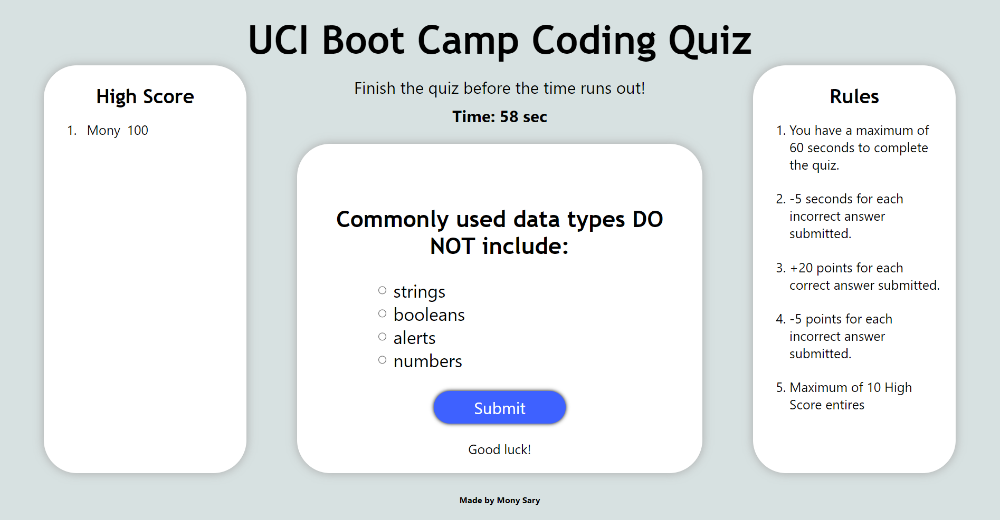

# Code Quiz

## Description

This is the coding quiz game for UCI Coding Boot Camp students.

## Installation

Launch this site using any browser via the following link: https://monysary.github.io/Code-Quiz/

## Usage

Begin the quiz by clicking on the Start button. A series of questions will be presented to the user, and they have 60 seconds to complete the quiz. But be careful of your choice, because for each submitted incorrect answer the timer will decrease by 5 seconds. The user can log their score at the end of the quiz, which will get displayed on the High Score board in the left sidebar.

The rules of the quiz are displayed on the right side bar. Points are awarded for correct submission. Points will also be taken away for each incorrect submission. Answers are submitted by selecting the answer choices, via radio input, and clicking the Submit button

## Credits

N/A

## License

N/A
